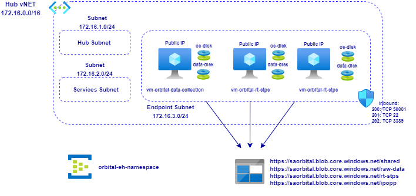

# **Azure Orbital - Infrastructure for Level 0 and Level 1 Processing of AQUA EOS Satellite Data**

# Contents

[Overview](#overview)

[Deployment](#deployment)

# Overview

This Terraform module deploys the infrastructure components required for [Level 0 & Level 1] processing of raw instrument data from AQUA, a NASA Earth Observation Satellite. This leverages Azure Orbital, a fully managed cloud-based ground station as a service, for ingesting space data directly into Azure.

This does not deploy the components for collecting the raw instrument data [the Azure Orbital Components], it is assumed that you have already:

* Onboarded onto the Azure Orbital Preview [documentation](https://docs.microsoft.com/en-us/azure/orbital/orbital-preview)
* Registered a Spacecraft [documentation](https://docs.microsoft.com/en-us/azure/orbital/register-spacecraft)
* Created a Contact Profile [documentation](https://docs.microsoft.com/en-us/azure/orbital/contact-profile)
* Scheduled a Contact [documentation](https://docs.microsoft.com/en-us/azure/orbital/schedule-contact)

In this scenario we are collecting raw instrument data from a NASA Earth Observation Satellite, AQUA. Is it names Aqua, Latin for water, because of the large amount of information that the mission is collecting about the Earth's water cycle, including evaporation from the oceans, water vapor in the atmosphere, clouds, precipitation, soil moisture, sea ice, land ice, and snow cover on the land and ice. Additional variables also being measured by Aqua include radiative energy fluxes, aerosols, vegetation cover on the land, phytoplankton and dissolved organic matter in the oceans, and air, land, and water temperatures.

A [single] Hub vNET is deployed with 3 Subnets. 2 Subnets are empty, ready for the deployment of a Bastion Host and VMs to support Common Services. 3 Virtual Machines have been deployed into the same subnet each having been configured using a Custom Script Extension to download and execute scripts for post-deployment configuration and software installation of the compenents needed:

* vm-orbital-data-collection - Data Collection VM: VM configured to receive traffic [e.g. netcat] from Orbital.
* vm-orbital-rt-stps - RT-STPS VM: The Real-time Software Telemetry Processing System (RT-STPS) ingests unsynchronized downlink data telemetry to various formats for further processing.
* vm-orbital-ipopp - International Planetary Observation Processing Package processes science data and derivative products [from AQUA and other missions] using Science Processing Algorithms [SPA]

NASA's Earth Observing System Data and Information System (EOSDIS) data products are processed at various levels ranging from Level 0 to Level 4. Level 0 products are raw data at full instrument resolution. At higher levels, the data are converted into more useful parameters and formats.

Some useful documentation:

Azure Orbital [documentation](https://docs.microsoft.com/en-us/azure/orbital/)  
NASA AQUA Mission [documentation](https://aqua.nasa.gov/)  
NASA Direct Readout Labratory [DRL] [documentation](https://directreadout.sci.gsfc.nasa.gov/)  
NASA Real-time Software Telemetry Processing System [RT-STPS] [documentation](https://directreadout.sci.gsfc.nasa.gov/?id=dspContent&cid=69)  
NASA International Planetary Observation Processing Package [IPOPP] [documentation](https://directreadout.sci.gsfc.nasa.gov/?id=dspContent&cid=68)  
NASA Data Processing Levels [documentation](https://www.earthdata.nasa.gov/engage/open-data-services-and-software/data-information-policy/data-levels#:~:text=Level%200%20products%20are%20raw,many%20have%20Level%204%20SDPs.)  
NORAD TRE Empemeris [documentation](https://aqua.nasa.gov/)  

Once deployed it should look like this:  
 
 

 
 
Note that this stores state locally so a [Terraform] backend block will need to be added if required.

# Deployment

Pre-requisites:

* This assumes that you have configured Terraform to use a Service Principal for Deployment:

  `https://registry.terraform.io/providers/hashicorp/azurerm/latest/docs/guides/service_principal_client_secret#configuring-the-service-principal-in-terraform`

  `Export ARM_CLIENT_SECRET to the shell outside terraform.tfvars for improved security`
  
Steps:
* Log in to Azure Cloud Shell at https://shell.azure.com/ and select Bash
* Ensure Azure CLI and extensions are up to date:
  
  `az upgrade --yes`
  
* If necessary select your target subscription:
  
  `az account set --subscription <Name or ID of subscription>`
  
* Clone the  GitHub repository:
  
  `git clone https://github.com/mattweale/azure-orbital-infrastructure`
  
* Change directory:
  
  `cd ./azure-orbital-aqua`

* Update terraform.tfvars:
  
  `Update environment variables for ARM_TENANT_ID, ARM_SUBSCRIPTION_ID and ARM_CLIENT_ID`

* Initialize terraform and download the azurerm resource provider:

  `terraform init`

* Now start the deployment (when prompted, confirm with **yes** to start the deployment):

  `terraform apply --auto-approve`

Deployment takes approximately 45 minutes, the vasy majority of this being the installation of IPOPP. 

## Explore and verify

After the Terraform deployment concludes successfully, the following has been deployed into your subscription:

* A resource group named **rg-orbital** containing:
* One vNET containing three subnets, AzureBastionSubnet, services-subnet and endpoint-subnet;
* Three VMs, vm-orbital-data-collection, vm-orbital-rt-stps and vm-orbital-ipopp;
* Data disk [256GB] attached and mounted to each VM at /datadrive;
* A Storage Account **saorbital** with Containers raw-data, rt-stps, ipopp and shared;
* Container [saorbital/shared] NFS Mounted to each VM at /nfsdata;
* An NSG attached to the endpoint-subnet with Inbound Traffic Allowed for 22, 3389 and 50001;
## Backlog

A number of things need to be improved.......

* Use fstab for making mounts permanent