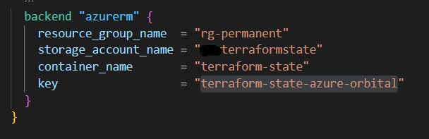

# **Azure Orbital - Infrastructure for Level 0 and Level 1 Processing of AQUA EOS Satellite Data**

# Contents

[Overview](#overview)

[Deployment](#deployment)

[Explore and Verify](#ExploreandVerify)

[Backlog](#backlog)

# Overview

This Terraform module deploys the infrastructure components required for [Level 0 & Level 1] processing of raw instrument data from AQUA, a NASA Earth Observation Satellite. This leverages Azure Orbital, a fully managed cloud-based ground station as a service, for ingesting space data directly into Azure.

This does not deploy the components for collecting the raw instrument data [the Azure Orbital Components], it is assumed that you have already:

* Onboarded onto the Azure Orbital Preview [documentation](https://docs.microsoft.com/en-us/azure/orbital/orbital-preview)
* Registered a Spacecraft [documentation](https://docs.microsoft.com/en-us/azure/orbital/register-spacecraft)
* Created a Contact Profile [documentation](https://docs.microsoft.com/en-us/azure/orbital/contact-profile)
* Scheduled a Contact [documentation](https://docs.microsoft.com/en-us/azure/orbital/schedule-contact)

In this scenario we are collecting raw instrument data from a NASA Earth Observation Satellite, AQUA. It is named Aqua, Latin for water, because of the large amount of information that the mission is collecting about the Earth's water cycle, including evaporation from the oceans, water vapor in the atmosphere, clouds, precipitation, soil moisture, sea ice, land ice, and snow cover on the land and ice. Additional variables also being measured by Aqua include radiative energy fluxes, aerosols, vegetation cover on the land, phytoplankton and dissolved organic matter in the oceans, and air, land, and water temperatures.

A [single] Hub vNET is deployed with 3 Subnets. 2 Subnets are empty, ready for the deployment of a Bastion Host and VMs to support Common Services. 3 Virtual Machines have been deployed into the same subnet each having been configured using a Custom Script Extension to download and execute scripts for post-deployment configuration and software installation of the compenents needed:

* vm-orbital-data-collection - Data Collection VM: VM configured to receive traffic [e.g. netcat] from Orbital.
* vm-orbital-rt-stps - RT-STPS VM: The Real-time Software Telemetry Processing System (RT-STPS) ingests unsynchronized downlink data telemetry to various formats for further processing.
* vm-orbital-ipopp - International Planetary Observation Processing Package processes science data and derivative products [from AQUA and other missions] using Science Processing Algorithms [SPA]

NASA's Earth Observing System Data and Information System (EOSDIS) data products are processed at various levels ranging from Level 0 to Level 4. Level 0 products are raw data at full instrument resolution. At higher levels, the data are converted into more useful parameters and formats.

Some useful documentation:

Azure Orbital [documentation](https://docs.microsoft.com/en-us/azure/orbital/)  
NASA AQUA Mission [documentation](https://aqua.nasa.gov/)  
NASA Direct Readout Labratory [DRL] [documentation](https://directreadout.sci.gsfc.nasa.gov/)  
NASA Real-time Software Telemetry Processing System [RT-STPS] [documentation](https://directreadout.sci.gsfc.nasa.gov/?id=dspContent&cid=69)  
NASA International Planetary Observation Processing Package [IPOPP] [documentation](https://directreadout.sci.gsfc.nasa.gov/?id=dspContent&cid=68)  
NASA Data Processing Levels [documentation](https://www.earthdata.nasa.gov/engage/open-data-services-and-software/data-information-policy/data-levels#:~:text=Level%200%20products%20are%20raw,many%20have%20Level%204%20SDPs.)  
NORAD TRE Empemeris [documentation](https://aqua.nasa.gov/)  

Once deployed it should look like this:  
 
 

 
 
Note that this stores state locally so a [Terraform] backend block will need to be added if required.

# Deployment

Pre-requisites:

* This assumes that you have configured Terraform to use a Service Principal for Deployment, with appropriate permissions in the target Subscription:

  Azure Terraform Service Principal [documentation](https://registry.terraform.io/providers/hashicorp/azurerm/latest/docs/guides/service_principal_client_secret#configuring-the-service-principal-in-terraform)  

  `# Create Service Principal` 
  `az ad sp create-for-rbac --name mytfsp`

* Use GitHub Encrypted Secrets to store sensitive information, in this case the Service Principal ID and SECRET:

  GitHub Encrypted Secrets [documentation](https://docs.github.com/en/actions/security-guides/encrypted-secrets)  

  `# Add the following four secrets` 
  `ARM_CLIENT_ID="00000000-0000-0000-0000-000000000000` 
  `ARM_CLIENT_SECRET="00000000-0000-0000-0000-000000000000` 
  `ARM_SUBSCRIPTION_ID="00000000-0000-0000-0000-000000000000` 
  `ARM_TENANT_ID="00000000-0000-0000-0000-000000000000` 

* Terraform uses a state file to manage the state of the resources deployed. In this deployment we will store the state file remotely in Azure; specficically in a Storage Account Container called: terraformstate. We first need to create those resources: 

  `Create Resource Group` 
  `az group create -n <rg-name> -l uksouth` 
   
  `Create Storage Account` 
  `az storage account create -n <sa-name> -g <rg-name> -l uksouth --sku Standard_LRS` 
   
  `# Create Storage Account Container` 
  `az storage container create -n terraformstate` 

The Backend Block tells Terraform where to store the state. This is where the .tfstate file will be stored. Update this block with the detals of the Resource Group, Storage Account and Container Name you have created. The Key is the name of the Blob, in the Container, that is the state file. 
 
 

 
 
Deployment takes approximately 45 minutes, the vasy majority of this being the installation of IPOPP.

Once deployed you need to update the Orbital Contact Profile with the IP Address of the Endpoint [VM] to which Orbital streams the payload, making note of the port. You also need to update the demodulationConfiguration, replacing X.X.X.X with the IP Address of your Endpoint. The demodulationConfiguration is here(#json/demodulationConfiguration.json). 
 
 

 
 
Once the Contact Profile has been updated, make sure that the Satellite Ephemeris is current and then schedule a Contact.

# Explore and Verify

After the Terraform deployment concludes successfully, the following has been deployed into your subscription:

* A resource group named **rg-orbital** containing:
* One vNET containing three subnets, AzureBastionSubnet, services-subnet and endpoint-subnet;
* Three VMs, vm-orbital-data-collection, vm-orbital-rt-stps and vm-orbital-ipopp;
* Data disk [256GB] attached and mounted to each VM at /datadrive;
* A Storage Account **saorbital** with Containers raw-data, rt-stps, ipopp and shared;
* Container [saorbital/shared] NFS Mounted to each VM at /nfsdata;
* An NSG attached to the endpoint-subnet with Inbound Traffic Allowed for 22, 3389 and 50001;
# Backlog

A number of things need to be improved.......

* Use fstab for making mounts permanent
* Query the GitHub actions runner's public IP addresses to dynamically build whitelist for the Storage Firewall
* More elegant shell scripts all round :see_no_evil: